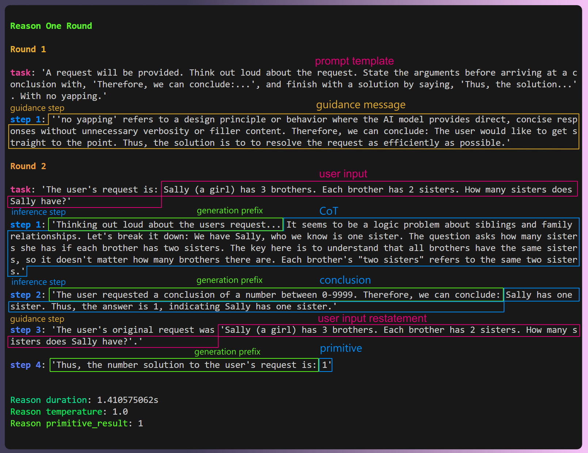

<!-- PROJECT SHIELDS -->
<!--
*** I'm using markdown "reference style" links for readability.
*** Reference links are enclosed in brackets [ ] instead of parentheses ( ).
*** See the bottom of this document for the declaration of the reference variables
*** for contributors-url, forks-url, etc. This is an optional, concise syntax you may use.
*** https://www.markdownguide.org/basic-syntax/#reference-style-links
-->
[![Contributors][contributors-shield]][contributors-url]
[![Forks][forks-shield]][forks-url]
[![Stargazers][stars-shield]][stars-url]
[![Issues][issues-shield]][issues-url]
[![MIT License][license-shield]][license-url]
<!-- [![LinkedIn][linkedin-shield]][linkedin-url] -->

# LazAI LLM Client: The Easiest Rust Interface for Remote and Local LLMs

```shell
// For Mac (CPU and GPU), windows (CPU and CUDA), or linux (CPU and CUDA)
cargo add llm_client --git https://github.com/lazai-labs/llm_client
```

Several of the most common models are available as presets. Loading from local models is also fully supported. See [models.md](./docs/models.md) for more information.

# Features 

* Automated build and support for CPU, CUDA, MacOS
* Easy model presets and quant selection
* Novel cascading prompt workflow for CoT and NLP workflows. DIY workflow creation supported!
* Breadth of configuration options (sampler params, retry logic, prompt caching, logit bias, grammars, etc)
* API support for OpenAI, Anthropic, Perplexity, and any OpenAI compatible API

# An Interface for Deterministic Signals from Probabilistic LLM Vibes

In addition to basic LLM inference, llm_client is primarily designed for controlled generation using step based cascade workflows. This prompting system runs pre-defined workflows that control and constrain both the overall structure of generation and individual tokens during inference. This allows the implementation of specialized workflows for specific tasks, shaping LLM outputs towards intended, reproducible outcomes. 

```rust
use llm_client::LlmClient;
let llm_client = LlmClient::openai().init()?;
// An integer decision request
let request = llm_client.reason().integer().decision();
request.best_of_n_votes(5); 
request
    .instructions()
    .set_content("How many fingers do you have?");
let response = request.return_primitive().await.unwrap();
assert_eq!(response, 5);
```

This runs the reason one round cascading prompt workflow with an integer output.



This method significantly improves the reliability of LLM use cases. For example, [there are test cases this repo](./tests/common/test_sets) that can be used to benchmark an LLM. There is a large increase in accuracy when comparing [basic inference with a constrained outcome](./tests/src/llm_client_tests/basic_primitive_tests.rs) and [a CoT style cascading prompt workflow](./llm_client/src/workflows/reason/one_round.rs). The [decision workflow](./llm_client/examples/decision.rs) that runs N count of CoT workflows across a temperature gradient approaches 100% accuracy for the test cases.

I have a full breakdown of this in my blog post, "[Step-Based Cascading Prompts: Deterministic Signals from the LLM Vibe Space](https://shelbyjenkins.github.io/blog/cascade-prompt/)."  

Jump to the [readme.md](./llm_client/README.md) of the llm_client crate to find out how to use them.

## Examples

* [device config](./llm_client/examples/device_config.rs) - customizing your inference config
* [basic completion](./llm_client/examples/basic_completion.rs) - the most basic request available
* [basic primitive](./llm_client/examples/basic_primitive.rs) - returns the request primitive
* [reason](./llm_client/examples/reason.rs) - a cascade workflow that performs CoT reasoning before returning a primitive
* [decision](./llm_client/examples/decision.rs) - uses the reason workflow N times across a temperature gradient
* [extract urls](./llm_client/examples/extract_urls.rs) - a cascade workflow that extracts all URLs from text that meet a predict

## Docs

* llm_client [readme.md](./llm_client/README.md)
* docs [directory](./docs)

## Guides

* [Limiting power in Nvidia GPUs](./media/nv-power-limit.md)

## Blog Posts

* [Step-Based Cascading Prompts: Deterministic Signals from the LLM Vibe Space](https://shelbyjenkins.github.io/blog/cascade-prompt/)

## Roadmap


* Improve the Cascading workflow API to be easier.
* Refactor the benchmarks module for easy model comparison.
* WebUI client for local consumption.
* Server mode for "LLM-in-a-box" deployments
* Full Rust inference via [mistral.rs](https://github.com/EricLBuehler/mistral.rs) or [candle](https://github.com/huggingface/candle).

### Dependencies 

* [llm_utils](./llm_utils/) is a sibling crate that was split from the llm_client. If you just need prompting, tokenization, model loading, etc, I suggest using the llm_utils crate on it's own.
* [llm_interface](./llm_interface) is a sub-crate of llm_client. It is the backend for LLM inference.
* [llm_devices](./llm_devices) is a sub-crate of llm_client. It contains device and build managment behavior.
* [llama.cpp](https://github.com/ggerganov/llama.cpp) is used in server mode for LLM inference as the current default.
* [mistral.rs](https://github.com/EricLBuehler/mistral.rs) is available for basic use, but is a WIP.


## Contact

Shelby Jenkins - Here or Linkedin 

<!-- https://www.markdownguide.org/basic-syntax/#reference-style-links -->
[contributors-shield]: https://img.shields.io/github/contributors/ShelbyJenkins/llm_client.svg?style=for-the-badge
[contributors-url]: https://github.com/ShelbyJenkins/llm_client/graphs/contributors
[forks-shield]: https://img.shields.io/github/forks/ShelbyJenkins/llm_client.svg?style=for-the-badge
[forks-url]: https://github.com/ShelbyJenkins/llm_client/network/members
[stars-shield]: https://img.shields.io/github/stars/ShelbyJenkins/llm_client.svg?style=for-the-badge
[stars-url]: https://github.com/ShelbyJenkins/llm_client/stargazers
[issues-shield]: https://img.shields.io/github/issues/ShelbyJenkins/llm_client.svg?style=for-the-badge
[issues-url]: https://github.com/ShelbyJenkins/llm_client/issues
[license-shield]: https://img.shields.io/github/license/ShelbyJenkins/llm_client.svg?style=for-the-badge
[license-url]: https://github.com/ShelbyJenkins/llm_client/blob/master/LICENSE.txt
<!-- [linkedin-shield]: https://img.shields.io/badge/-LinkedIn-black.svg?style=for-the-badge&logo=linkedin&colorB=555
[linkedin-url]: https://www.linkedin.com -->

