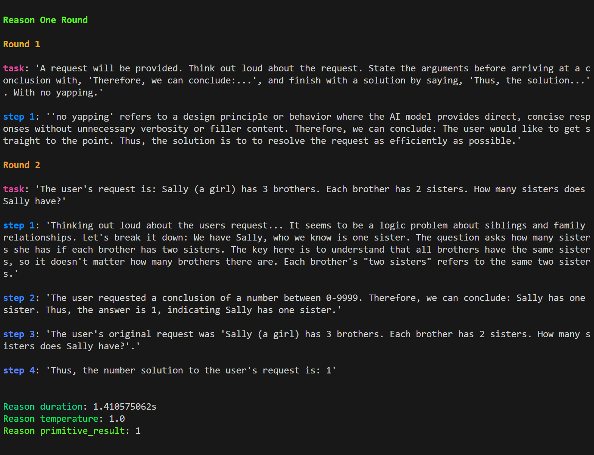

<!-- PROJECT SHIELDS -->
<!--
*** I'm using markdown "reference style" links for readability.
*** Reference links are enclosed in brackets [ ] instead of parentheses ( ).
*** See the bottom of this document for the declaration of the reference variables
*** for contributors-url, forks-url, etc. This is an optional, concise syntax you may use.
*** https://www.markdownguide.org/basic-syntax/#reference-style-links
-->
[![Contributors][contributors-shield]][contributors-url]
[![Forks][forks-shield]][forks-url]
[![Stargazers][stars-shield]][stars-url]
[![Issues][issues-shield]][issues-url]
[![MIT License][license-shield]][license-url]
<!-- [![LinkedIn][linkedin-shield]][linkedin-url] -->

# llm_client: An Interface for Deterministic Signals from Probabilistic LLM Vibes

```rust
// Load Local LLMs
let llm_client = LlmClient::llama_cpp().available_vram(48).mistral7b_instruct_v0_3().init().await?;

// Build requests
let response: u32 = llm_client.reason().integer()
    .instructions()
    .set_content("Sally (a girl) has 3 brothers. Each brother has 2 sisters. How many sisters does Sally have?")
    .return_primitive().await?;

// Recieve 'primitive' outputs
assert_eq!(response, 1)
```

This runs the reason one round cascading prompt workflow with an integer output.



### From AI Vibes to the Determinstic Real World

Large Language Models (LLMs) are somewhere between conventional programming and databases: they process information like rule-based systems while storing and retrieving vast amounts of data like databases. But unlike the deterministic outputs of if statements and database queries, raw LLMs produce outputs that can be described as 'vibes' — probabilistic, context-dependent results that may vary between runs. Building on vibes may work for creative applications, but in real-world applications, a vibey output is a step back from the reliability and consistency of traditional programming paradigms.

llm_client is an interface for building cascading prompt workflows from dynamic and novel inputs, running the steps of the workflows in a linear or reactive manner, and constraining and interpretting LLM inference as actionable signals. This allows the integration of LLMs into traditional software systems with the level of consistency and reliability that users expect.

### llm_client Implementation Goals

* **As Friendly as Possible**: the most intuitive and ergonomic Rust interface possible 
* **Local and Embedded**: 
    * Designed for native, in-process integration—just like a standard Rust crate
    * No stand-alone servers, containers, or services
    * Minimal cloud dependencies, and fully local, fully supported
* **Works**: Accurate, reliable, and observable results from available workflows


### Traditional LLM Constraints Impact LLM Performance

Using an LLM as part of your business logic requires extracting usable signals from LLM responses. This means interpretting the text generated by an LLM using something like Regex or LLM constraints. Controlling the output of an LLM is commonly achieved with constraints like logit bias, stop words, or grammars.

However, from practical experience, as well [as studies](https://arxiv.org/abs/2408.02442), constraints such as logit bias and grammars negatively impact the quality of LLMs. Furthermore, these merely constrain the inference at the token level, when we may wish to shape the structure of the entire generation.

### Controlled Generation with Step Based Cascade Workflows

llm_client's cascade prompting system runs pre-defined workflows that control and constrain both the overall structure of generation and individual tokens during inference. This allows the implementation of specialized workflows for specific tasks, shaping LLM outputs towards intended, reproducible outcomes. 

This method significantly improves the reliability of LLM use cases. For example, [there are test cases this repo](./tests/common/test_sets) that can be used to benchmark an LLM. There is a large increase in accuracy when comparing [basic inference with a constrained outcome](./tests/basic_primitive_tests.rs) and [a CoT style cascading prompt workflow](./src/workflows/reason/one_round.rs). The [decision workflow](./examples/decision.rs) that runs N count of CoT workflows across a tempature gradient approaches 100% accuracy for the test cases.

### Cascade Prompt Elements

* **Workflow**: A workflow, or '**flow**', is a high level object that runs the individual elements.
* **Rounds**: Each round is a pair of a user turn and an assistant turn. Turns are sometimes referred to as 'messages'.
    * Both the user turn and the assistant turn can be pre-generated, or dynamically generated.
* **Tasks**: The 'user message' in the user turn of a round. Generically refered to 'task' for the sake of brevity.
* **Steps**: Each assistant turn consists of multiple steps.
    * **Inference steps** generate text via LLM inference.
    * **Guidance steps** generate text from pre-defined static inputs or dynamic inputs from the program.
* **Generation prefixes**: Assistant steps can be prefixed with content.
* **Dynamic sufixes**: Assistant steps can also be suffixed with additional content after generation.

### An Example Cascade: CoT Reasoning

An example of a cascade workflow is the [one round reasoning workflow](./src/workflows/reason/one_round.rs).

In this example the work flow is run linearly as built, but it's also possible to run dynamic workflows where each step is ran one at a time and the behavior of the workflow can be dynamic based on the outcome of that step. See [extract_urls](./examples/extract_urls.rs) for an example of this.


## Reasoning with Primitive Outcomes

A constraint enforced CoT process for reasoning. First, we get the LLM to 'justify' an answer in plain english. This allows the LLM to 'think' by outputting the stream of tokens required to come to an answer. Then we take that 'justification', and prompt the LLM to parse it for the answer. See [the workflow for implementation details](./src/workflows/reason/one_round.rs).

- Currently supporting returning booleans, u32s, and strings from a list of options

- Can be 'None' when ran with `return_optional_primitive()`

```rust
    // boolean outcome
    let reason_request = llm_client.reason().boolean();
    reason_request
        .instructions()
        .set_content("Does this email subject indicate that the email is spam?");
    reason_request
        .supporting_material()
        .set_content("You'll never believe these low, low prices 💲💲💲!!!");
    let res: bool = reason_request.return_primitive().await.unwrap();
    assert_eq!(res, true);

    // u32 outcome
    let reason_request = llm_client.reason().integer();
    reason_request.primitive.lower_bound(0).upper_bound(10000);
    reason_request
        .instructions()
        .set_content("How many times is the word 'llm' mentioned in these comments?");
    reason_request
        .supporting_material()
        .set_content(hacker_news_comment_section);
    // Can be None
    let response: Option<u32> = reason_request.return_optional_primitive().await.unwrap();
    assert!(res > Some(9000));

    // string from a list of options outcome
    let mut reason_request = llm_client.reason().exact_string();
    reason_request
        .instructions()
        .set_content("Based on this readme, what is the name of the creator of this project?");
    reason_request
        .supporting_material()
        .set_content(llm_client_readme);
    reason_request
        .primitive
        .add_strings_to_allowed(&["shelby", "jack", "camacho", "john"]);
    let response: String = reason_request.return_primitive().await.unwrap();
    assert_eq!(res, "shelby");
```

See [the reason example for more](./examples/reason.rs)

## Decisions with N number of Votes Across a Temperature Gradient 

Uses the same process as above N number of times where N is the number of times the process must be repeated to reach a consensus. We dynamically alter the temperature to ensure an accurate consensus. See [the workflow for implementation details](./src/workflows/reason/decision.rs).

- Supports primitives that implement the reasoning trait

- The consensus vote count can be set with `best_of_n_votes()`

- By default `dynamic_temperture` is enabled, and each 'vote' increases across a gradient

```rust
    // An integer decision request
    let decision_request = llm_client.reason().integer().decision();
    decision_request.best_of_n_votes(5); 
    decision_request
        .instructions()
        .set_content("How many fingers do you have?");
    let response = decision_request.return_primitive().await.unwrap();
    assert_eq!(response, 5);
```

See [the decision example for more](./examples/decision.rs)

## Structured Outputs and NLP

- Data extraction, summarization, and semantic splitting on text.

- 'Some people, when confronted with a problem, think "I know, I'll use regular expressions." Now they have two problems.' Using Regex to parse and structure the output of LLMs puts an exponent over this old joke. llm_client uses constraints to conform the outputs of LLMs rather than trying to extract information from a non-constrainted LLM generation.  

- Currently implemented NLP workflows are url extraction. 

See [the extract_urls example](./examples/extract_urls.rs)

## Basic Primitives

A generation where the output is constrained to one of the defined primitive types. See [the currently implemented primitive types](./src/primitives/mod.rs). These are used in other workflows, but only some are used as the output for specific workflows like reason and decision.

- These are fairly easy to add, so feel free to open an issue if you'd like one added.

See [the basic_primitive example](./examples/basic_primitive.rs)

## LLM -> LLMs

- Basic support for API based LLMs. Currently, anthropic, openai, perplexity

- Perplexity does not *currently* return documents, but it does create it's responses from live data

```rust
    let llm_client = LlmClient::perplexity().sonar_large().init();
    let mut basic_completion = llm_client.basic_completion();
    basic_completion
        .prompt()
        .add_user_message()
        .set_content("Can you help me use the llm_client rust crate? I'm having trouble getting cuda to work.");
    let response = basic_completion.run().await?;
```

See [the basic_completion example](./examples/basic_completion.rs)

## Loading Custom Models from Local Storage

- llm_client uses the [llm_utils crate](https://crates.io/crates/llm_utils) on the backend. To load custom models, checkout the [llm_utils documentation](https://github.com/shelbyJenkins/llm_utils?tab=readme-ov-file#model-loading-%EF%B8%8F). 

```rust
    // From a local storage
    let llm_client = LlmClient::llama_cpp().local_quant_file_path(local_llm_path).init().await?;

    // From hugging face
    let llm_client = LlmClient::llama_cpp().hf_quant_file_url("https://huggingface.co/MaziyarPanahi/Meta-Llama-3-8B-Instruct-GGUF/blob/main/Meta-Llama-3-8B-Instruct.Q6_K.gguf").init().await?;
```
## Configuring Requests

- All requests and workflows implement the `BaseRequestConfigTrait` which gives access to the parameters sent to the LLM

- These settings are normalized across both local and API requests

```rust
    let llm_client = LlmClient::llama_cpp()
        .available_vram(48)
        .mistral7b_instruct_v0_3()
        .init()
        .await?;

    let basic_completion = llm_client.basic_completion();

    basic_completion
        .temperature(1.5)
        .frequency_penalty(0.9)
        .max_tokens(200);
```
See [See all the settings here](./src/components/base_request.rs)


## Guides

* [Limiting power in Nvidia GPUs](./media/nv-power-limit.md)


## Installation

llm_client currently relies on llama.cpp. As it's a c++ project, it's not bundled in the crate. In the near future, llm_client will support mistral-rs, an inference backend built in Candle and supporting great features like ISQ. Once integration is complete, llm_client will be pure Rust and can be installed as just a crate.


- Clone repo:
```cmd
git clone --recursive https://github.com/ShelbyJenkins/llm_client.git
cd llm_client
```
- Add to cargo.toml:
```toml
[dependencies]
llm_client = {path="../llm_client"}
```
- Optional: Build devcontainer from `llm_client/.devcontainer/devcontainer.json` This will build out a dev container with nvidia dependencies installed. 

- Build llama.cpp (<a href="https://github.com/ggerganov/llama.cpp/blob/master/docs/build.md">This is dependent on your hardware. Please see full instructions here</a>):
  ```cmd
    // Example nvidia gpu build
    cd llm_client/src/llm_backends/llama_cpp/llama_cpp
    make GGML_CUDA=1
  ```

## Roadmap

* Migrate from llama.cpp to <a href="https://github.com/EricLBuehler/mistral.rs">mistral-rs</a>. This would greatly simplify consuming as an embedded crate. It's currently a WIP. It may also end up that llama.cpp is behind a feature flag as a fallback. 
    * Current blockers are grammar migration 
    * and multi-gpu support
* Reasoning where the output can be multiple answers
* Expanding the NLP functionality to include semantic splitting and data further extraction.
* Refactor the benchmarks module

### Dependencies 
<a href="https://github.com/64bit/async-openai">async-openai</a> is used to interact with the OpenAI API. A modifed version of the async-openai crate is used for the Llama.cpp server. If you just need an OpenAI API interface, I suggest using the async-openai crate.

<a href="https://github.com/mochi-neko/clust">clust</a> is used to interact with the Anthropic API. If you just need an Anthropic API interface, I suggest using the clust crate.

<a href="https://github.com/shelbyJenkins/llm_utils">llm_utils</a> is a sibling crate that was split from the llm_client. If you just need prompting, tokenization, model loading, etc, I suggest using the llm_utils crate on it's own.


## Contributing

Yes.

## License

Distributed under the MIT License. See `LICENSE.txt` for more information.

## Contact

Shelby Jenkins - Here or Linkedin 


<!-- https://www.markdownguide.org/basic-syntax/#reference-style-links -->
[contributors-shield]: https://img.shields.io/github/contributors/ShelbyJenkins/llm_client.svg?style=for-the-badge
[contributors-url]: https://github.com/ShelbyJenkins/llm_client/graphs/contributors
[forks-shield]: https://img.shields.io/github/forks/ShelbyJenkins/llm_client.svg?style=for-the-badge
[forks-url]: https://github.com/ShelbyJenkins/llm_client/network/members
[stars-shield]: https://img.shields.io/github/stars/ShelbyJenkins/llm_client.svg?style=for-the-badge
[stars-url]: https://github.com/ShelbyJenkins/llm_client/stargazers
[issues-shield]: https://img.shields.io/github/issues/ShelbyJenkins/llm_client.svg?style=for-the-badge
[issues-url]: https://github.com/ShelbyJenkins/llm_client/issues
[license-shield]: https://img.shields.io/github/license/ShelbyJenkins/llm_client.svg?style=for-the-badge
[license-url]: https://github.com/ShelbyJenkins/llm_client/blob/master/LICENSE.txt
<!-- [linkedin-shield]: https://img.shields.io/badge/-LinkedIn-black.svg?style=for-the-badge&logo=linkedin&colorB=555
[linkedin-url]: https://www.linkedin.com -->

